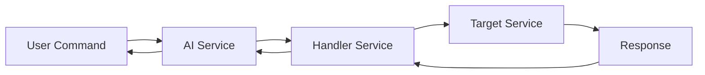
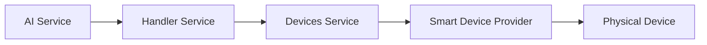
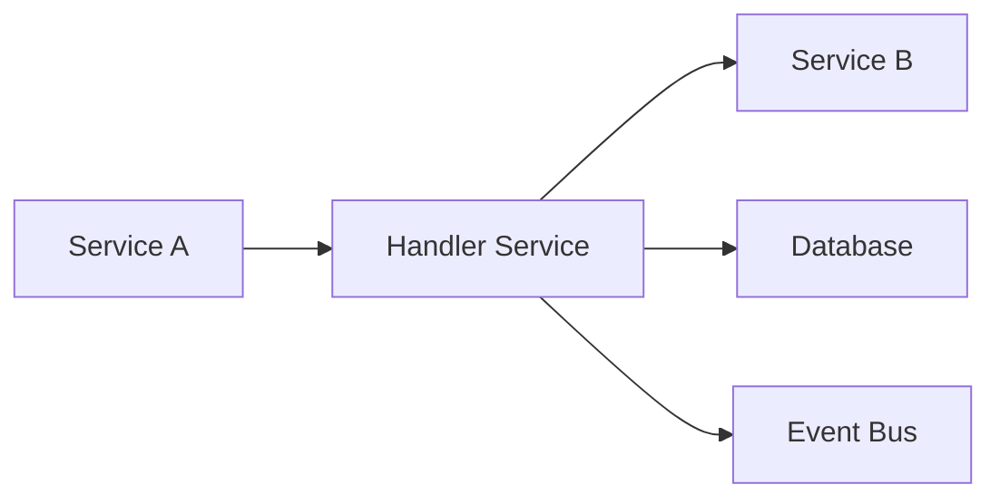
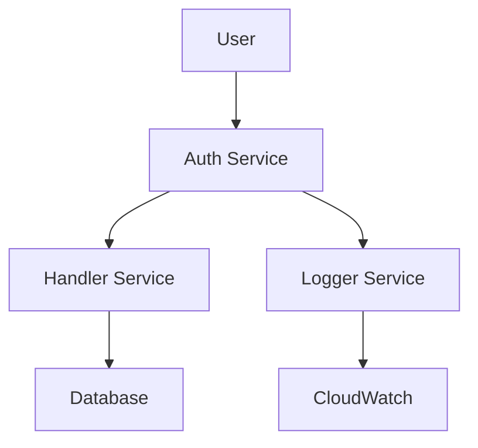
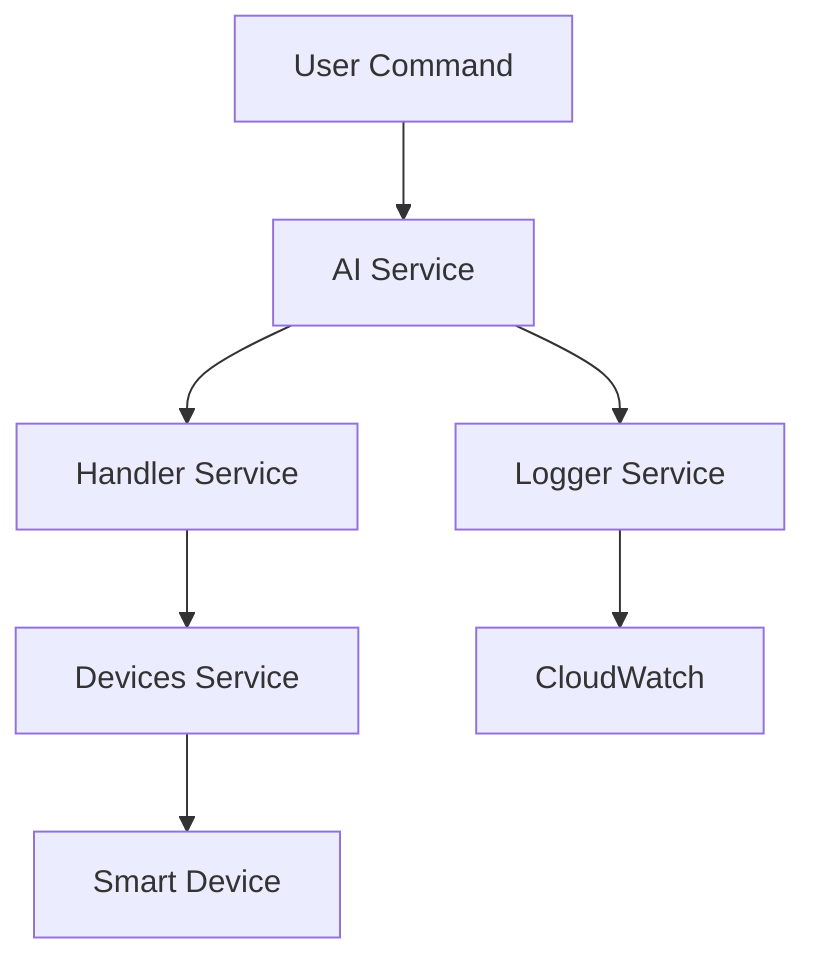

<Check>
  Roomi is built on a modern microservices architecture that provides scalability, reliability, and flexibility. Each service has a specific responsibility and communicates with others through well-defined APIs.
</Check>

## Roomi Platform Architecture

Roomi's microservices architecture is designed for scalability, reliability, and maintainability. Each service operates independently while maintaining seamless communication through well-defined APIs and the Handler service as the central coordination hub.

<CardGroup cols={2}>
  <Card title="Scalability" icon="arrow-trend-up" href="#scalability">
    Independent service scaling based on demand
  </Card>
  <Card title="Reliability" icon="shield" href="#reliability">
    Fault isolation and graceful degradation
  </Card>
  <Card title="Flexibility" icon="settings" href="#flexibility">
    Easy service updates and feature additions
  </Card>
  <Card title="Maintainability" icon="wrench" href="#maintainability">
    Clear service boundaries and responsibilities
  </Card>
</CardGroup>

## Core Services

### AI Service - The Brain

<CardGroup cols={2}>
  <Card title="Natural Language Processing" icon="message-circle">
    Understand and process user commands in multiple languages
  </Card>
  <Card title="Service Orchestration" icon="network">
    Coordinate actions across all other services
  </Card>
  <Card title="Context Management" icon="brain">
    Maintain conversation context and user preferences
  </Card>
  <Card title="Background Tasks" icon="clock">
    Handle long-running operations asynchronously
  </Card>
</CardGroup>

**Communication Pattern:**

<CodeGroup>




```javascript
// Example: User command flow
const processCommand = async (userCommand) => {
  // 1. AI Service processes natural language
  const aiResponse = await aiService.process(userCommand);
  
  // 2. Handler Service routes to appropriate service
  const handlerResponse = await handlerService.route(aiResponse);
  
  // 3. Target service executes action
  const result = await targetService.execute(handlerResponse);
  
  return result;
};
```

</CodeGroup>

### Devices Service - Smart Device Abstraction

<CardGroup cols={2}>
  <Card title="Multi-Provider Support" icon="layers">
    Philips Hue, SmartThings, Tuya, and more
  </Card>
  <Card title="Protocol Translation" icon="refresh-cw">
    Automatic conversion between different protocols
  </Card>
  <Card title="Device Discovery" icon="search">
    Automatic detection and registration of new devices
  </Card>
  <Card title="Real-time Monitoring" icon="activity">
    Live device status and health monitoring
  </Card>
</CardGroup>

**Communication Pattern:**

<CodeGroup>




```javascript
// Example: Device control flow
const controlDevice = async (deviceId, action) => {
  // 1. AI Service determines device and action
  const deviceCommand = await aiService.analyzeDeviceCommand(action);
  
  // 2. Handler Service routes to Devices Service
  const routeCommand = await handlerService.routeToDevices(deviceCommand);
  
  // 3. Devices Service translates and executes
  const result = await devicesService.execute(routeCommand);
  
  return result;
};
```

</CodeGroup>

### Handler Service - System Communication Hub

<CardGroup cols={2}>
  <Card title="Database Operations" icon="database">
    CRUD operations and data persistence
  </Card>
  <Card title="Message Routing" icon="send">
    Route messages between services efficiently
  </Card>
  <Card title="Event Management" icon="zap">
    Handle and distribute system events
  </Card>
  <Card title="Service Discovery" icon="compass">
    Locate and connect to other services
  </Card>
</CardGroup>

**Communication Pattern:**

<CodeGroup>




```javascript
// Example: Inter-service communication
const sendMessage = async (fromService, toService, message) => {
  // 1. Service A sends message through Handler
  const routeRequest = await handlerService.route({
    from: fromService,
    to: toService,
    message: message
  });
  
  // 2. Handler Service routes to Service B
  const response = await handlerService.deliver(routeRequest);
  
  return response;
};
```

</CodeGroup>

### Auth Service - Private Authentication

<CardGroup cols={2}>
  <Card title="Invite-Only Registration" icon="mail">
    Secure invitation system with access control
  </Card>
  <Card title="Multi-Factor Authentication" icon="shield">
    OTP and UAE Pass integration
  </Card>
  <Card title="Session Management" icon="key">
    Secure token-based sessions
  </Card>
  <Card title="Permission System" icon="lock">
    Role-based access control
  </Card>
</CardGroup>

### Logger Service - CloudWatch Integration

<CardGroup cols={2}>
  <Card title="Structured Logging" icon="file-text">
    JSON-formatted logs to CloudWatch
  </Card>
  <Card title="Performance Monitoring" icon="activity">
    Real-time metrics and dashboards
  </Card>
  <Card title="Error Tracking" icon="alert-triangle">
    Error aggregation and analysis
  </Card>
  <Card title="Audit Trail" icon="shield">
    Complete operation logging
  </Card>
</CardGroup>

### Services Platform - Third-Party Integration

<CardGroup cols={2}>
  <Card title="Events Management" icon="calendar">
    Community events and social activities
  </Card>
  <Card title="Complaints System" icon="message-square">
    Maintenance requests and issue tracking
  </Card>
  <Card title="Payment Processing" icon="credit-card">
    Billing and payment services
  </Card>
  <Card title="Facility Booking" icon="building">
    Amenity booking and management
  </Card>
</CardGroup>

## Service Communication Flow

### 1. User Authentication Flow

<Steps>
  <Step title="User Request">
    User attempts to authenticate with credentials
  </Step>
  <Step title="Auth Service">
    Validates credentials and generates tokens
  </Step>
  <Step title="Handler Service">
    Routes authentication data to database
  </Step>
  <Step title="Logger Service">
    Records authentication attempt for audit
  </Step>
</Steps>

<CodeGroup>



</CodeGroup>

### 2. Device Control Flow

<Steps>
  <Step title="User Command">
    User provides natural language device command
  </Step>
  <Step title="AI Processing">
    AI interprets command and determines actions
  </Step>
  <Step title="Handler Routing">
    Handler routes command to Devices Service
  </Step>
  <Step title="Device Execution">
    Devices Service controls the physical device
  </Step>
</Steps>

<CodeGroup>



</CodeGroup>